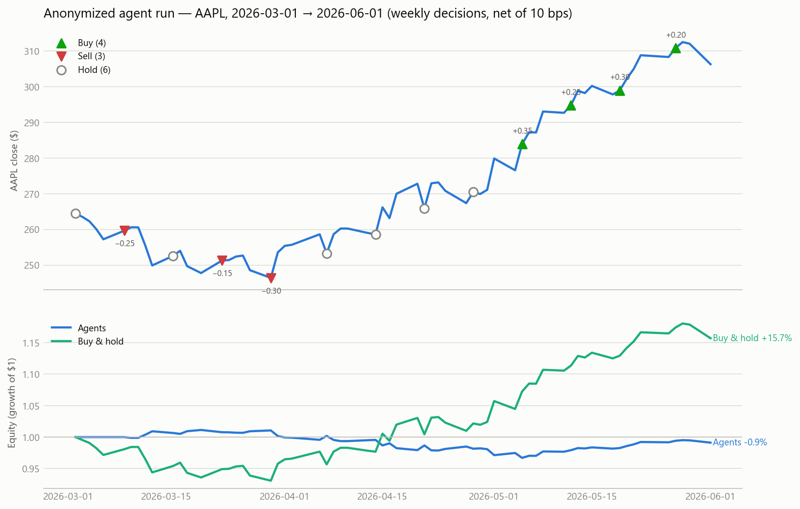
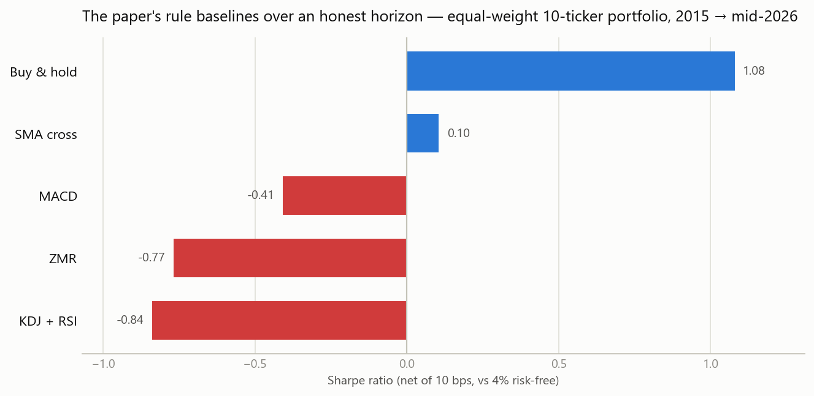

# trading-agents-lab

**Do LLM trading agents actually have skill, or are they reciting memorized price history?**
A rigorous research implementation of **TradingAgents: Multi-Agents LLM Financial Trading
Framework** ([Xiao et al., arXiv:2412.20138](https://arxiv.org/abs/2412.20138)) — plus the
quant research harness the paper should have had.

[](https://github.com/Kantamaniprakash/trading-agents-lab/actions/workflows/ci.yml)


The paper simulates a trading firm with LLM agents: four analysts (market/technical,
fundamentals, news, sentiment) feed a bull-vs-bear research debate, a trader synthesizes a
decision, a risk-management trio (risky/neutral/safe) debates it, and a fund manager
approves the final trade. This repo reproduces that architecture faithfully — and wraps it
in an evaluation framework that fixes the paper's four methodological problems:

| Paper's weakness | What this repo does instead |
|---|---|
| 3-month backtest window, 3 tickers | 11.5 years of data, 10 tickers across sectors, multi-year walk-forward test window |
| LLM likely trained on the backtest period (Jan–Mar 2024 is inside GPT-4o's training data) | Anti-leakage prompt clause on every agent + `--anonymize` mode that masks ticker names and dates from every prompt, making memorized-price-path recall substantially harder (price levels stay raw — see Limitations) |
| No transaction costs | 10 bps per unit turnover, always on; cost sensitivity reported |
| Weak baselines (naive MACD/SMA rules) | The paper's five baselines **plus** a LightGBM walk-forward model (expanding window, embargoed splits) as a serious ML benchmark |

## The headline result

With memorization masked, the agent desk **did not beat buy-and-hold**. Run fully
anonymized (the model sees `TICKER-X` and `Day T`, never "AAPL" or a date), the agents
shorted a March dip, stayed short (−0.30) through the entire April recovery, and only
flipped long in May — after the move:



| Mar 1 – Jun 1, 2026 (64 trading days) | cum return | ann vol | Sharpe | max DD | hit rate |
|---|---:|---:|---:|---:|---:|
| Agent desk (anonymized) | **−0.9%** | 6.0% | −1.21 | 4.4% | 50% |
| Buy & hold | **+15.7%** | 20.9% | 2.66 | 6.9% | 54% |

*Yes, this run is itself one ticker over one quarter — deliberately, as a methodology
demonstration on data the model can't simply recall. At n = 64 days the Sharpe gap is
directional evidence, not statistical significance; the multi-ticker, multi-quarter sweep
is roadmap item 1. The interesting part is the shape of the failure: persistently late,
not merely unlucky.*

The agents traded cautiously (never above 0.35 exposure), which kept volatility at a
third of buy-and-hold — but the direction was wrong for two of the three months. One
13-decision run costs ≈ **$3.70 of API calls** (104 deep + 39 quick), and every response
is disk-cached, so reruns are free and deterministic.

<details>
<summary><b>Full decision log</b> (per-day debate transcripts in <a href="results/transcripts/">results/transcripts/</a>)</summary>

*Decisions are fund-manager-approved target exposures (SELL = short). On HOLD days the
engine carries the prior position forward — a size printed on a HOLD (e.g. 04-28) is
advisory and ignored. Positions take effect the next trading day and pay 10 bps per unit
turnover. The trader may overrule the research verdict after the risk debate (e.g. the
05-19 BUY on a NEUTRAL verdict).*

| date | decision | position held | research verdict |
|---|---|---:|---|
| 2026-03-02 | HOLD | 0.00 | NEUTRAL |
| 2026-03-09 | SELL 0.25 | −0.25 | BEARISH |
| 2026-03-16 | HOLD | −0.25 | NEUTRAL |
| 2026-03-23 | SELL 0.15 | −0.15 | BEARISH |
| 2026-03-30 | SELL 0.30 | −0.30 | BEARISH |
| 2026-04-07 | HOLD | −0.30 | NEUTRAL |
| 2026-04-14 | HOLD | −0.30 | NEUTRAL |
| 2026-04-21 | HOLD | −0.30 | NEUTRAL |
| 2026-04-28 | HOLD (0.20) | −0.30 | NEUTRAL |
| 2026-05-05 | BUY 0.35 | +0.35 | BULLISH |
| 2026-05-12 | BUY 0.25 | +0.25 | BULLISH |
| 2026-05-19 | BUY 0.30 | +0.30 | NEUTRAL |
| 2026-05-27 | BUY 0.20 | +0.20 | BULLISH |

</details>

## Architecture

```
             ┌──────────────────────  Analyst team  ──────────────────────┐
  data ─────▶│ Market (deep)  Fundamentals (quick)  News+Sentiment (quick)│
             └──────────────────────────┬────────────────────────────────┘
                          structured reports (not chat history)
                                        ▼
                       Bull ⇄ Bear research debate (n rounds, deep)
                                → facilitator verdict (JSON)
                                        ▼
                          Trader decision (deep, JSON action/size)
                                        ▼
                    Risky / Neutral / Safe risk debate (quick)
                          → Fund manager approval (deep, JSON)
                                        ▼
              signal ∈ [-1,1] ──▶ backtest engine (t+1 shift, costs)
```

- **Quick model**: `claude-haiku-4-5` · **Deep model**: `claude-opus-4-8`
  (override with `TRADINGLAB_QUICK_MODEL` / `TRADINGLAB_DEEP_MODEL`).
- Every LLM response is disk-cached (`cache/llm/`), so re-running a backtest is free and
  deterministic. Every decision day writes a full markdown transcript (explainability).
- The backtest engine enforces no-lookahead by construction: signals computed at close of
  day *t* earn returns from *t+1*, positions pay 10 bps per unit turnover.

Full design rationale and module contracts: [DESIGN.md](DESIGN.md).

## Quickstart

```bash
pip install -e .
python -m pytest tests/ -q          # 47 tests, incl. no-lookahead perturbation tests

python -m tradinglab.cli download   # 10 tickers, 2015 → today (cached parquet)
python -m tradinglab.cli baselines  # the paper's 5 rule strategies, full history
python -m tradinglab.cli train-ml   # LightGBM walk-forward, test window 2021 →
```

### Running the LLM agents (needs `ANTHROPIC_API_KEY`)

```bash
export ANTHROPIC_API_KEY=sk-ant-...   # PowerShell: $env:ANTHROPIC_API_KEY = "sk-ant-..."

# 3 months of AAPL, one decision per week, anonymized (leakage-safe):
python -m tradinglab.cli agents --ticker AAPL --start 2026-03-01 --end 2026-06-01 \
    --every 5 --anonymize

# live mode (fetches current fundamentals + news into the prompts — only meaningful
# when the window ends ~today, since yfinance fundamentals are not point-in-time):
python -m tradinglab.cli agents --ticker AAPL --start 2026-05-01 --end 2026-07-03 --live
```

Cost control: `--every N` (decide every N trading days), `--max-days N` (cap decision
count). One decision day ≈ 8 deep + 3 quick calls ≈ 15–25k input tokens. The CLI prints a
token/cost summary after every run; repeated runs hit the disk cache and cost nothing.

**For a trustworthy evaluation of the agent layer, only use windows after the model's
knowledge cutoff, or `--anonymize`.** Backtesting an LLM on dates it was trained through
measures memory, not skill — this is the paper's central flaw.

## The rest of the evidence

All numbers net of 10 bps costs, Sharpe vs 4% risk-free, equal-weight 10-ticker portfolio.
Baseline and long/short ML tables in `results/*.csv`, per-ticker equity plots in
`results/*.png`. Regenerate the README figures with `python scripts/make_figures.py`
(requires the price cache from `python -m tradinglab.cli download` first).

### The paper's baselines, 2015 → mid-2026 (2,891 trading days)



| strategy | cum return | ann return | Sharpe | max DD |
|---|---:|---:|---:|---:|
| buy & hold | **+1848%** | **+29.5%** | **1.08** | 34% |
| SMA cross | +64% | +4.4% | 0.10 | 24% |
| MACD | −43% | −4.8% | −0.41 | 49% |
| ZMR | −69% | −9.6% | −0.77 | 72% |
| KDJ+RSI | −75% | −11.2% | −0.84 | 76% |

Over this 11.5-year horizon three of the four rule baselines lose money outright, and the
fourth (SMA cross, Sharpe 0.10) is left far behind by buy-and-hold. "Beating them" over
three months is not evidence of skill.

### LightGBM walk-forward (23 scale-free technical features; test 2021 → mid-2026)

| variant | cum return | Sharpe | avg daily turnover |
|---|---:|---:|---:|
| long/short, θ=0 | −19% | −0.51 | 0.69 |
| long-only, θ=0 | +76% | 0.48 | 0.35 |
| buy & hold (same window) | +259% | 0.97 | ~0 |

*The long/short row is `PORTFOLIO/ml` in `results/ml_metrics.csv`; the long-only row is a
`train-ml --long-only` rerun (which overwrites that same CSV), and turnover is computed by
the backtest engine but not exported to the CSV. All three are reproducible from the
committed `results/ml_predictions.csv`.*

Findings a 3-month backtest could never show:
1. **The short side is systematically toxic** in an upward-drifting mega-cap universe —
   every long/short variant has negative Sharpe at every threshold.
2. **Turnover is the killer**: 0.35–0.69 daily turnover at 10 bps costs ≈ 9–17%/year,
   larger than any daily-horizon predictive edge the model finds.
3. Daily direction prediction from technical features alone does not beat buy-and-hold
   after costs on this universe. This is the bar the LLM agent layer has to clear — and
   the null hypothesis it must be measured against.

## Verification

- 47 pytest tests, including **perturbation-based no-lookahead property tests** (mutate
  future rows → assert all earlier features/indicators/engine outputs are bit-identical).
- A five-dimension adversarial review pass (lookahead, statistics, costs, data hygiene,
  prompt leakage — every finding independently re-verified before acceptance) surfaced
  and fixed 17 issues, including: the walk-forward embargo not covering the label
  horizon, drawdown measured only from post-inception peaks, Sortino using the wrong
  downside deviation, warm-up-period phantom positions in two baselines, and an
  anonymization gap.

## Limitations (read before believing any backtest)

- Survivorship bias: the 10-ticker universe is today's winners; results overstate what was
  achievable ex ante. A point-in-time universe (e.g. historical S&P constituents) is on
  the roadmap.
- Anonymization masks tickers and dates but not price levels or volumes — a well-known
  ticker is in principle identifiable from its price/volume scale. Rebasing prices to 100
  at window start is a planned hardening step; until then, anonymize + post-cutoff window
  is the strongest available guarantee.
- yfinance fundamentals/news are current-snapshot, not point-in-time → live mode only.
- Single-asset signals with equal-weight aggregation; no position sizing, borrow costs,
  or market-impact modeling beyond linear bps.
- The anonymized agent result is one ticker over one quarter — a proof of methodology,
  not a verdict on LLM trading. The multi-ticker, multi-quarter sweep is the next run.
- **Nothing here is investment advice.** Backtest ≠ live performance; markets are close to
  efficient at daily horizons and most published edges are artifacts of exactly the
  methodology errors this repo exists to avoid.

## Research roadmap

1. **Post-cutoff agent evaluation** — run the agent pipeline weekly on data after the
   backbone model's knowledge cutoff; compare anonymized vs named prompts to *measure*
   memorization leakage directly (the delta is the leak).
2. **Cross-sectional ML** — predict relative (rank) returns across the universe instead of
   absolute direction; long top-quintile / short bottom-quintile with weekly rebalance to
   cut turnover.
3. **Cost-aware execution** — only trade when the signal change clears a cost hurdle
   (no-trade band), which the threshold sweep suggests is worth several Sharpe tenths.
4. **Hybrid model** — feed the ML model's prediction into the agent snapshot as one more
   analyst report; test whether LLM reasoning adds incremental alpha over its own inputs.
5. **Point-in-time universe & fundamentals** (paid data), intraday extensions, and
   regime-conditional evaluation (2022 bear vs 2023–24 bull).

## License

MIT — see [LICENSE](LICENSE).
